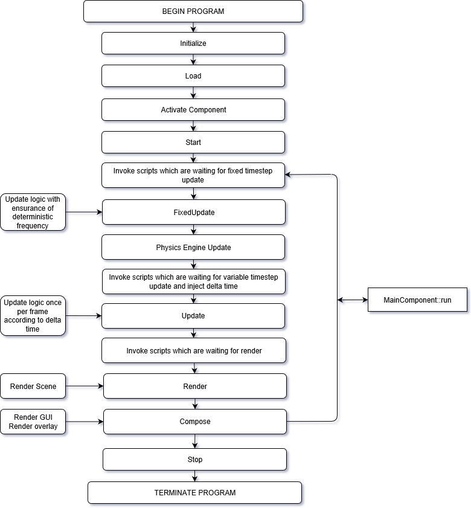
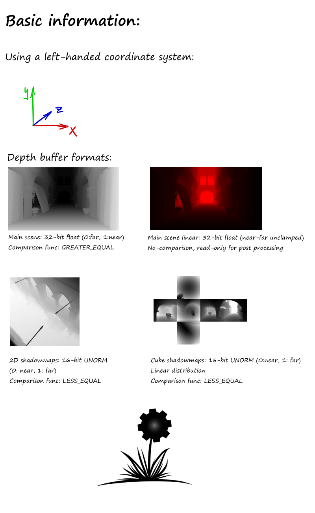

# WickedEngine Documentation (work in progress)

## High Level Interface
The high level interface consists of classes that allow for extending the engine with custom functionality. This is usually done by overriding the classes.

- MainComponent
	- This is the main runtime component that has the Run() function. It should be included in the application entry point while calling Run() in an infinite loop
	- It has a SetWindow function that expects a platform specific window handle. It is necessary to call SetWindow() before calling Run()
	- Once Run() is called in a loop, it will perform Initialize(), Update(), FixedUpdate(), Render(), Compose() functions. 
	- ActivatePath() will activate a render path and optionally fade the screen to transition between them. Refer to RenderPath for additional details.
	- Refer to the order of execution diagram below for an overview:

Order of execution:

 <i>(Diagram generated with draw.io)</i>

- RenderPath
	- This is an empty base class that can be activated with a MainComponent. It calls its Start(), Update(), FixedUpdate(), Render(), Compose(), Stop() functions as needed. Override this to perform custom gameplay or rendering logic.
	- It has several ready to use variants, such as RenderPath2D, RenderPath3D_Deferred, LoadingScreen, etc.

- RenderPath2D
	- Capable of handling 2D rendering to offscreen buffer in Render() function, or just the screen in Compose() function.
	- It has some functionality to render wiSprite and wiFont onto rendering layers

- RenderPath3D
	- By itself, it only does everything that RenderPath2D can do.
	- It must be specialized for a specific 3D rendering algorithm, such as RenderPath3D_Deferred, Forward, TiledForward, etc.

- RenderPath3D_Forward
	- Implements simple Forward rendering. It uses few render targets, but not very efficient with many lights

- RenderPath3D_Defered
	- Implements old school Deferred rendering. It uses many render target, capable of advanced post processing effects, and good to render many lights.

- RenderPath3D_TiledForward
	- Implements an advanced method of Forward rendering to be able to render many lights efficiently. It uses few render targets, so memory efficient.

- RenderPath3D_TiledDeferred
	- Implements and advanced method of Deferred rendering to be able to render many lights with reduced memory bandwidth requirements.

- RenderPath3D_PathTracing
	- Implements a compute shader based path tracing solution. In a static scene, the rendering will converge to ground truth.

## System
You can find out more about the Entity-Component system and other engine-level systems under ENGINE/System filter in the solution.

- wiECS
	- This is the core entity-component relationship handler class: ComponentManager
	- Entity is a number, it can reference any number of different components through ComponentManager containers
	- Component is not defined, it can be any data, that is stored inside a ComponentManager along entities

- wiSceneSystem
	- This contains Scene, a class that is responsible of holding and managing everything in the world
	- There are also all of the Component types, like TransformComponent, MeshComponent, etc.

- wiJobSystem
	- Manages the execution of concurrent tasks
	- Execute() function will schedule a task for execution on a separate thread
	- Dispatch() function will schedule a task for execution on multiple parallel threads
	- Wait() function will block until all jobs have finished. All scheduling operations are put on hold too

- wiInitializer
	- Initializes all engine systems

- wiWindowRegistration
	- This is a platform specific utility to manage the native display window

## Physics
You can find the physics system related functionality under ENGINE/Physics filter in the solution.
It uses the entity-component system to perform updating all physics components in the world.

- wiPhysicsEngine_Bullet
	- Bullet physics engine library implementation of the physics update system

## Graphics
You can find the Graphics related classes un der ENGINE/Graphics filter in the solution. The most notable classes are the folowing:

- wiRenderer
	- This is a collection of functions that facilitate an engine-level rendering logic, like DrawScene, DrawLights, etc...

- wiImage
	- This can render images to the screen

- wiFont
	- This can render fonts to the screen

- wiGraphicsDevice
	- This is the low-level rendering interface. It must implement either DirectX1, DirectX12 or Vulkan (at the moment)
	- See wiGraphicsDevice_DX11 for DirectX11 rendering interface
	- See wiGraphicsDevice_DX12 for DirectX12 rendering interface
	- See wiGraphicsDevice_Vulkan for Vulkan rendering interface

- There are many other classes that you can find here, such as wiEmittedParticle, to render emitter components. 

You can see a quickstart guide on the following picture regarding the most common rendering resources:

## Helpers
A collection of engine-level helper classes

- wiArchive
	- This is used for serializing binary data
- wiHelper
	- Many helper utility functions, like screenshot, readfile, messagebox, splitpath, sleep, etc...
- wiMath
	- Math related helper functions, like lerp, triangleArea, HueToRGB, etc...
- wiProfiler
	- A timer utility that can measure CPU and GPU timings and used across the engine
- wiRandom
	- random number generator
- ...

## Input
The input interface can be found here

- wiInputManager
	- This manages all inputs
	- There are several functions, such as down(), press(), etc. to check button states.

## Network
TODO: Rewrite the networking systems

## Scripting
This is the place for the Lua scipt interface. The systems that are bound to Lua have the name of the system prefixed by _BindLua. 

- wiLua
	- The Lua scripting interface

## Tools
This is the place for tools that use engine-level systems

- wiBackLog
	- Used to log any messages by any system, from any thread. It can draw itself to the screen. It can execute Lua scripts.

