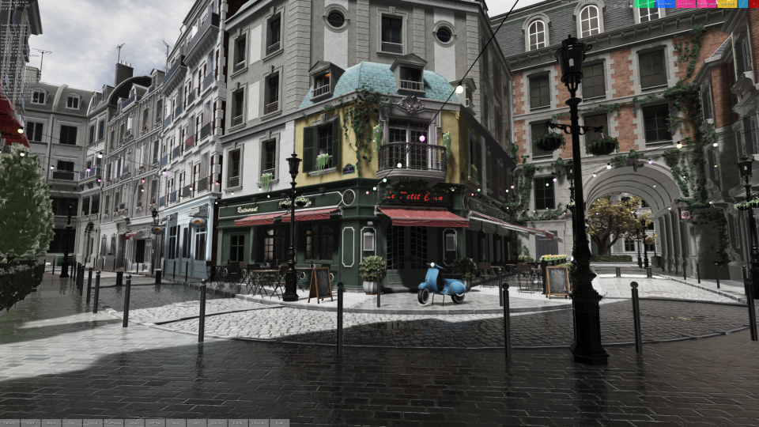
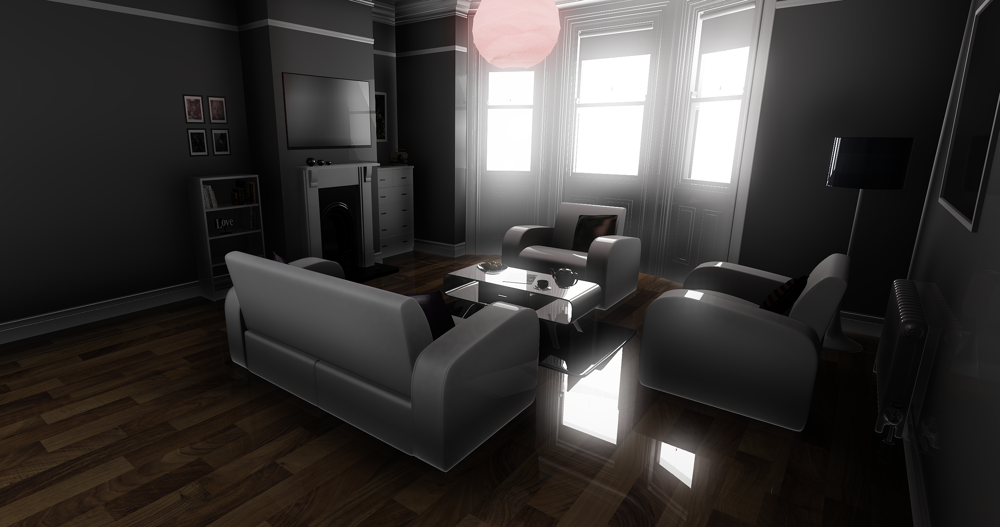
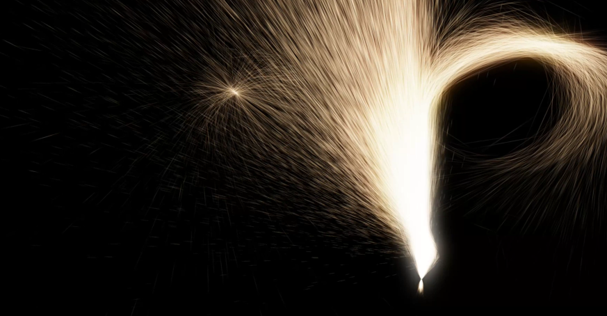
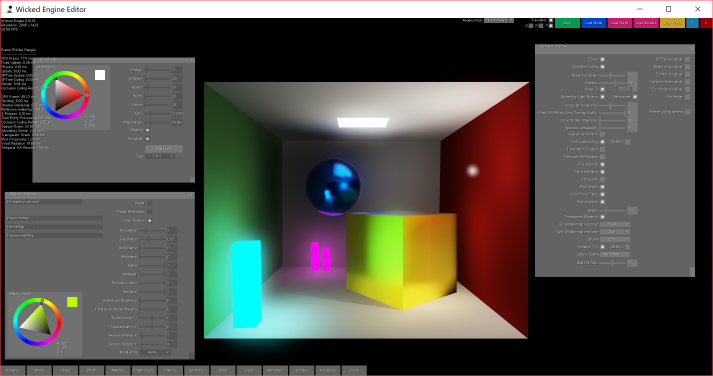
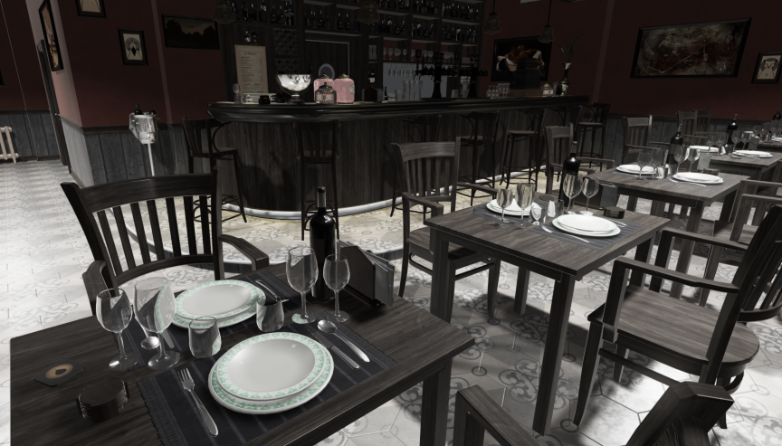
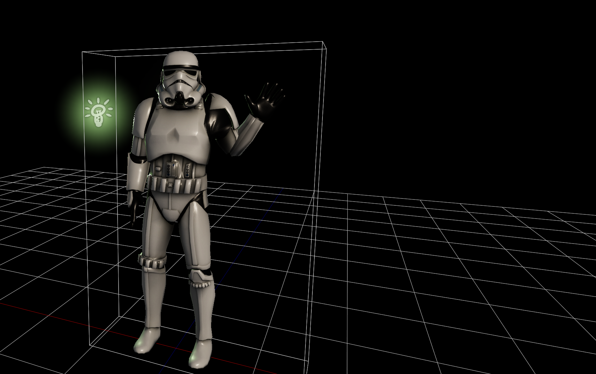

# Wicked Engine

[![Build status][s1]][av] [![Download][s4]][do] [![License: MIT][s3]][li] [![Join the chat at https://gitter.im/WickedEngine/Lobby][s2]][gi]

[s1]: https://ci.appveyor.com/api/projects/status/3dbcee5gd6i7qh7v?svg=true
[s2]: https://badges.gitter.im/WickedEngine/Lobby.svg
[s3]: https://img.shields.io/badge/License-MIT-yellow.svg
[s4]: https://img.shields.io/badge/download%20build-editor-blue.svg

[av]: https://ci.appveyor.com/project/turanszkij/wickedengine
[gi]: https://gitter.im/WickedEngine/Lobby?utm_source=badge&utm_medium=badge&utm_campaign=pr-badge&utm_content=badge
[li]: https://opensource.org/licenses/MIT
[do]: https://ci.appveyor.com/api/projects/turanszkij/wickedengine/artifacts/WickedEngineEditor.zip?branch=master

### Overview:

Wicked Engine is an open-source game engine written in C++. The main focus is to be easy to set up and use, light weight, high performance, and graphically advanced.
The full source code is provided with the MIT license, which means, anyone is free to use it for anything without additional considerations. The code shall not contain any parts with other licensing. The code is hosted on GitHub: https://github.com/turanszkij/WickedEngine For any questions, please open an issue there.

[Documentation](Documentation/WickedEngine-Documentation.md) 
[Scripting API Documentation](Documentation/ScriptingAPI-Documentation.md) 
[Features](features.txt) 
[Devblog](https://turanszkij.wordpress.com/) 
[Videos](https://www.youtube.com/playlist?list=PLLN-1FTGyLU_HJoC5zx6hJkB3D2XLiaxS) 

To test the engine, this solution contains several projects which you can build out of the box with Visual Studio 2017. There shall be no external dependencies. You can now also [download the latest Editor build!][do]
- You can run the "Editor" or the "Tests" project to check out features and play around in a 3D environment, load models, scripts, etc. 
- You can find a "Template_Windows" project which is a minimal set up to get the engine up and running in a clean Windows 10 application.
- Be sure to build in "Release" mode for optimal performance. Debugging support will be reduced.
- Be sure to set an appropriate startup project such as the "Editor" or "Tests" for example.
- There are multiple sample models in the "models" folder. You can load any of them inside the Editor.
- There are multiple sample LUA scripts in the "scripts" folder. You can load any of them inside the Editor, but please check how to use them first by reading the first few lines of the scripts.
- Please open an Issue here on GitHub if you encounter any difficulties.

The default renderer is DirectX 11. The DirectX 12 renderer is now available (experimental). Vulkan renderer is now available (experimental).
You can specify command line arguments for each application to switch between render devices or other settings. Currently the list of options:
<table>
  <tr>
    <th>Argument</th>
    <th>Description</th>
  </tr>
  <tr>
    <td>dx12</td>
    <td>Create DirectX 12 rendering device (Windows 10 required)</td>
  </tr>
  <tr>
    <td>vulkan</td>
    <td>Create Vulkan rendering device*. (Only if engine was built with Vulkan SDK installed)</td>
  </tr>
  <tr>
    <td>debugdevice</td>
    <td>Create rendering device with debug layer enabled for validation. Performance will be degraded.</td>
  </tr>
  <tr>
    <td>hlsl6</td>
    <td>Reroute shader loading path to use shader model 6 shaders** (DirectX 12 only)</td>
  </tr>
</table>

* *Before enabling the Vulkan API, you must first also compile SPIR-V shaders. This step is not yet included in the standard build process. First, run the "generate_shader_buildtask_spirv.py"
Python script which will generate the SPIR-V shader building program "build_SPIRV.bat". Run "build_SPIRV.bat" to build all HLSL shaders as SPIR-V bytecode format for Vulkan. Shader loading after this 
is automatic if you start the application with Vulkan support.
This feature is experimental, not tested thoroughly yet.

* **To load HLSL 6 shaders, replicate the exact steps as with SPIR-V, but the pyhton script you should run is called "generate_shader_buildtask_spirv.py" which will generate "build_HLSL6.bat". 
This feature is experimental, not tested thoroughly yet.

### Platforms:
- Windows PC Desktop (x86, x64)
- Universal Windows (PC, Phone, XBOX One)

### Requirements:

- Windows 10
- DirectX 11 compatible GPU
- Visual Studio 2017
- Windows 10 SDK

### Getting started: 

The interface is designed to be somewhat similar to the XNA framework, with overridable Load, Update, Render methods, switchable rendering components, content managers and all together project structure. 
However, it makes use of the C++ programming language instead of C#, which enables lower level and more performant code in the hand of experienced developers. On the other hand, the developer can also make use of the 
widely popular Lua scripting language for faster iteration times and more flexible code structure.

Wicked Engine is provided as a static library. This means, that when creating a new project, the developer has to link against the compiled library before using its features. 
For this, you must first compile the engine library project for the desired platform. For Windows Desktop, this is the WickedEngine_Windows project. 
Then set the following dependencies to this library in Visual Studio this way in the implementing project:

1. Open Project Properties -> Configuration Properties
2. C/C++ -> General -> Additional Include Directories: 
	- ./WickedEngine
3. Linker -> General -> Additional Library Directories:
	- Directory of your built .lib file (For example ./x64/Release)
4. Also be sure to compile with a non-DLL runtime library for Release builds:
	- Project settings -> C/C++ -> Code Generation -> Runtime Library -> Multi threaded

When your project settings are set up, time to #include "WickedEngine.h" in your source. I recommend to include this
in the precompiled header file. This will enable the use of all the engine features and link the necessary binaries. After this, you should already be able to build your project. 
But this will not render anything for you yet, because first you must initialize the engine. For this, you should create a main program component by deriving from MainComponent class of 
Wicked Engine and initialize it appropriately by calling its Initialize() and SetWindow() functions, and calling its run() function inside the main message loop. 
You should also activate a RenderableComponent for the rendering to begin. You can see an example for this inside the Tests and Editor projects.

If you want to create an UWP application, #define WINSTORE_SUPPORT preprocessor for the whole implementing project and link against the WickedEngine_UWP library.

When everything is initialized properly, you should see a black screen. From this point, you can make an application by writing scripts in either C++ or Lua code. Please see the Tests project for such examples.

### Contents:

- ./Documentation/						- Documentation files
- ./logo/								- Logo artwork images
- ./models/								- Sample model files
- ./WickedEngine/						- Wicked Engine Library project
- ./Editor/								- Editor project
- ./Tests/								- Testing framework project
- ./Template_Windows					- Template project for Windows applications
- ./WickedEngine.sln 					- Visual Studio Solution
- ./io_export_wicked_wi_bin.py 			- Blender 2.72+ script to export scene

### Scripting API:

You can use a great number of engine features through the Lua scripting api, which can even be used real time while the program is running. The included applications, like the Editor,
contain a scripting input method toggled by the "Home" key. A blue screen will be presented where the user can type in LUA commands. It is very minimal in regards to input methods.
For further details, please check the scripting API documentation: [Wicked Engine Scripting API](Documentation/ScriptingAPI-Documentation.md)

### Editor:

The editor is now available but also work in progress. Just build the editor project and run it, then you will be presented with a blank scene.
You can import files exported from Blender (.wio) with the scipt described below. You can also save models into the .wimf format from the Editor
and open them. You can also open OBJ format models, which are very simple model files, not supporting many features provided by the engine.
Test model and scene files are now available in the WickedEngine/models directory.

### Model import/export:

The only common model format supported right now is Wavefront OBJ. 

For advanced model format capabilities, like skeletal animations, particle systems, physics, etc. use the provided Blender exporter python script: io_export_wicked_wi_bin.py  

Notes on exporting:
- Names should not contain spaces inside Blender 
	The problem is the c++ side code which parses the text files such as it breaks parsing on spaces. 
	Mesh files are already exported as binary, so those are okay
	Suggested fix: write binary export for everything
- Separate files generated 
	I've written the exporter to write different categories of the scene to different files for easier debugging
	from a text editor. If the exporter is rewritten to write binary for everything, such debugging will
	not be possible so might as well merge the files (except mesh files and error message file)
- Only animation supported is skeletal animation 
- Animation Action names should contain their armature's name so that the exporter matches them correctly 
	Suggested fix: find a better way of matching armatures and actions
- Animation only with linear curves (so no curves) 
	Suggested fix: implement curves support into the engine and the exporter
- Only one uv map support 
	Light maps and other effects requiring multiple uv maps are not possible yet.

	

### Graphics:

Please feel free to learn/copy/use any shaders or rendering techniques that you can find here. General information about the engine that might help you port these to your own solution
is summarized in the image below:

